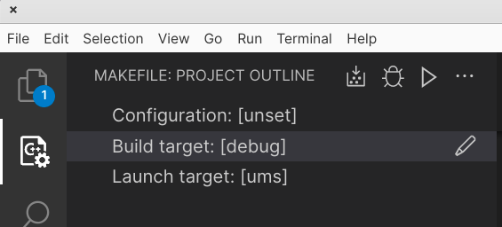
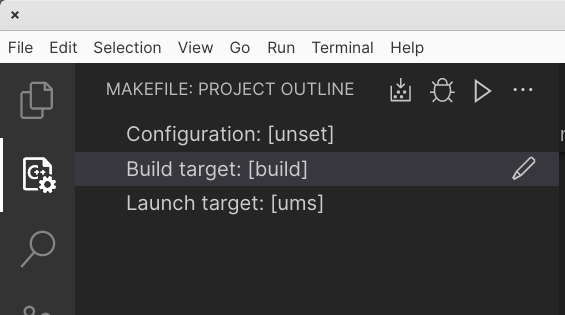
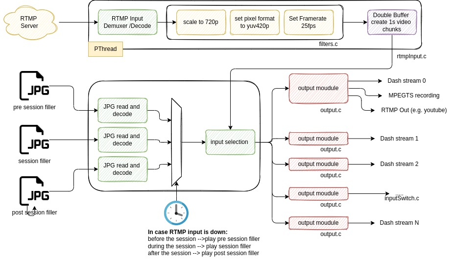

# Introduction - Uninterruptible Media Server

This media server is capable of reading RTMP streams comming from
tools like [OBS - Open Brodacaster Studio](https://obsproject.com/) and
outputs it as DASH/HLS/RTMP formats. It can also record the incoming video
as an MPEGTS video file.

The main purpose of this media player is to implement a very stable platform
for low bandwidht scenarios as they can happen in countries like India or other non
developed countries. The focus is on a reliable video streaming platform
where content should not get interrupted, or recovers automatically in failure
states , without user interaction. It is intended to be able to run even on a
180kbps connection.

It is not been designed to deliver maximum video and audio quality. If high quality
streaming is required other open source implementations might be a better choice.
E.g. the ffmpeg command line tool could be used directly for this.

# Installation

## Install dependencies

```bash
#install dependencies for ubuntu 20.04 (might work for other versions also)
cd ./lib/ffmpeg/ubuntu-20.04.sh
```

## Compile FFMPEG-libav from source

This project is based on the FFMPEG libraries which need to be compiled. A
script compatible with Ubuntu 20.04 is available and needs to be executed
first to build the right FFMPEG libraries and components from sourc code.

```bash
cd ./lib/ffmpeg
./compile.sh
```

## Setup visual studio code build / debug environment

1. Install the following packets in visual studio code:

- [C/C++](https://code.visualstudio.com/docs/languages/cpp)
- [C/C++ Extension Pack](https://marketplace.visualstudio.com/items?itemName=ms-vscode.cpptools-extension-pack)
- [VS Code Makefile tools](https://marketplace.visualstudio.com/items?itemName=ms-vscode.makefile-tools)

You can refer to this link in order to configure the Makefile tool to run / debug the application
[Makefile Tool Tutorial](https://devblogs.microsoft.com/cppblog/now-announcing-makefile-support-in-visual-studio-code/)

2. Setup the Clang config for automatic formating

```
file -> settings -> Extensions --> C/C++ --> Clang_format_fallback Style = google
```

3. Setup make file in vscode for debugging or production respectively
   
   

# Docker images

## Install RTMP docker

For testing purposes or running ums in production environment we
have setup a docker container which setup a nginx-rtmp server.
Please check out the [nginx-rtmp repo](https://github.com/thomaskhub/nginx-rtmp)
for detail on how to build and start the RTMP docker container.

## ums docker image

The projects [Dockerfile](./Dockerfile) will create a docker image that can be used to compile the libraries, compile the ums application or run ums application.

```bash
#Build the image
docker build -t ums .

#Compile the ffmpeg library
docker run --rm -v $(pwd)/lib/ffmpeg:/ffmpeg ums /bin/sh /ffmpeg/compile.sh

#Compile the ums application for production
docker run --rm -it -v $(pwd):/$(pwd) -w $(pwd) \
  -e PKG_CONFIG_PATH=$(pwd)/lib/ffmpeg/ffmpeg_build/lib/pkgconfig \
  ums \
  /usr/bin/make

#Compile the ums application for development
docker run --rm -it -v $(pwd):/$(pwd) -w $(pwd) \
  -e PKG_CONFIG_PATH=$(pwd)/lib/ffmpeg/ffmpeg_build/lib/pkgconfig \
  ums \
  /usr/bin/make debug

#Run the ums application in the docker container
#Application must have been compiled before calling this command
docker run --rm \
 -v $(pwd):$(pwd) \
 -v /tmp/dash:/tmp/dash \
 -v /tmp:/tmp \
 -w $(pwd) \
 ums $(pwd)/ums \
  -mode live \
  -rtmpIn rtmp://localhost/live/input \
  -rtmpOut rtmp://localhost/live/output \
  -dash /tmp/dash/index.mpd \
  -rec /tmp/rec.ts \
  -preFiller ..../english-pre-filler.jpg \
  -sessionFiller ..../english-session-filler.jpg \
  -postFiller ..../english-post-filler.jpg

```

# System description

**Work in progress**


- System is connected to an rtmp server
- the rtmp input is first normalized to 720p with 25fps and YUV420p pixel format
- then the rtmp input video is sliced into 1 second chunks
  - 1 seconds chunk to allow easy switching between filler videos and RTMP input as AV sync will be easy to maintain
- the rtmp inputSwitch.c will read the rtmp chunk buffer and forward the frames to the output modules.
  - If rtmp input goes down the switch uses preloaded frames from a jpg file instead so that stream never interrupts.
  - three different fillers are being played depending on the wallclock time and the event configuration
- the main output module will forward the video files to another RTMP server (16-07-2022 Implemented until here)
  - it can also optionally store the video chunks in a MPEGTS file
  - and it also forwards it the the Dash mux
- As Dash/HLS are ABR protocols each output needs to create different bandwidth and resolutions.

  - x264 encoder is implemented in the output.c file.

# Testing

## Setup

- ensure the docker container is started (instructions see above)
- install mpv player
  ```bash
  sudo apt install mpv
  ```
- clone  repo
- change TEST_BIN_PATH variable test/config.sh to point to the cloned ums-test-repo
- build the ums application with `make` command
- go into the ./test directory and execute the available tests

  - check_test_setup.sh

    - check if all tools are installed to run the tests. Basically it will publish
      an RTMP stream to the docker container and display it using mpv media player

  - 001_basic_test.sh :

    - starts ums to listen to rtmp input and output rtmp, mpegts recording and DASH/HLS

    ```bash
    #Open one terminal
    cd ./test
    ./001_basic_test.sh

    #Open another terminal and execute this command to push video to rtmp input
    cd ./test
    ./rtmp_publish.sh

    #Open another terminal and execute this command to display rtmp output
    mpv rtmp://localhost/live/output

    #Open another terminal and execute this command to display MPEGTS recording
    mpv ./test/rec/rec.ts

    ```

## Test cases Live Mode

A summery of what needs to be tested:

### Filler Video selection

- if RTMP input is failing filler video is generated from JPG files and pushed
  instead of real video
- We have to check that filler videos are properly played according to the program
  timeline
- Program time line is defined by three timestamps.
  - streamStart --> this is the time where the camera stream is started by
    the streaming team (camera system is turned on). System can be tested during this time.
    - If rtmp input fails during this time we tell participant that we will start session soon
  - sessionStart --> this is the time where the session starts
    - if rtmp input fails during this time we inform participant that error has come
  - sessionEnd --> this is the expected end of the program. But it does not mean that system
    stops after this. I can happen that program might get extended.
    - If rtmp input fails after this time we will show a black image
- Filler video should be played according to these specs:
  - if now is smaller then streamStart nothing should be pushed
  - if now > streamStart && now < sessionStart --> push preSession filler (-preFiller argument of ums)
  - if now >= sessionStart && nov < sessionEnd --> push session filler (-sessionFiller argument of ums)
  - if now > sessionEnd --> push post session filler (-postFiller argument of ums)

### Audio Video Sync (libsync)

- we need to test libsync for long playing videos
- we need to test libsync for videos when video transitions between filler video
  and real data .e.g. run video for 15min, let filler play for 15min and repeat this.
  At no point in time av-sync issues should be noticed (subjective testing)

### Long running videos

- System must run without any issues for up to 6hours generating correct
  Dash/HLS, rtmp output and MPEGTS recording

### Connect Streaming output to Youtube

- need to check if the RTMP output is compatible with yoututbe and video
  is running properly on youtube

### Autorecovery if RTMP output breaks

- if rtmp output connection breaks, e.g. youtube connection is interrupted
  it should automatically reestablish the connection and play the current live
  stream to youtube

### Check MPEGTS recording

- MPEGTS recording will be used to restream a live session at a later point
  (e.g. restreaming the live session at a different time in a different timezone)
- Convert MPEGTS recording to Dash/HLS Video-On-Demand files and test playback on
  Shaka player

### Test Dash/HLS

- Test dash and hls streams on Isha Shaka player
- Test Dash / HLS on Mobile phone, laptop, different devices.

- # Implementation Status

  - Live Mode
    - Dash and HLS output is implemented
    - RTMP input is implemented which is normalized to 720p, 2888000bps
    - RTMP output is implemented for 720p stream
    - MPEG TS recording is implemented for 720p stream
  - Video On Demand [Not implemented Yet]
    - [ ] Rename rtmpIn parameter to input and allow it to either specify a MPEGTS
          recording, or rtmp input stream
      - MPEGTS file must be processed as fast as possible
      - Filler video generation can be disabled
    - [ ] Disable RTMP output and MPEGTS recording for VOD. Only Dash/HLS is needed
  - Video As Stream [Not implemented Yet]
    - [ ] as in VOD make sure that we can specify a input MPEGTS recording
    - [ ] input file must be processed in realtime (see -re parameter in ffmpeg as example)
    - [ ] Disable RTMP output and MPEGTS recording for VOD. Only Dash/HLS is needed

```

```
